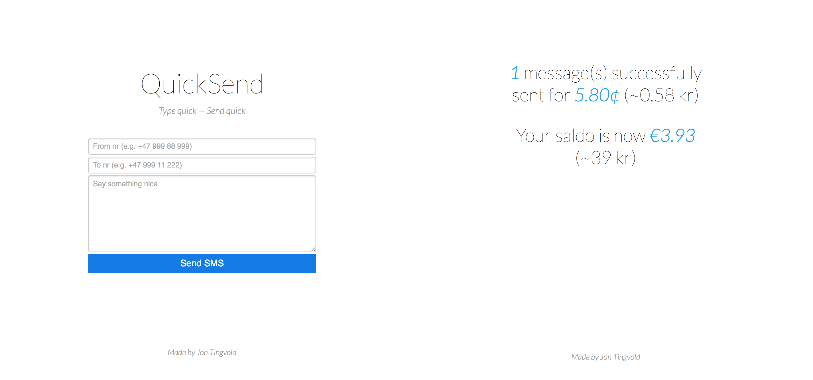

QuickSend – A single-file Nexmo SMS API client
===========

QuickSend is a single-file web application for sending SMS through Nexmo's SMS API. It was created by Jon Tingvold in 2011–13.

The aim of the project was twofolded. Firstly, I wanted nice and fast interface to send SMS from the desktop. Back in 2011 when I only had a feature phone, I often sent SMS from the desktop where I could type them quicker. Secondly, I wanted a nice interface to demonstrate SMS spoofing; that you are totally free to set which number the message appears to come from.

There are two versions of the web app, a PHP-version (recommended) and an HTML-version which can be used locally on desktops without installing a web server, but without a decent successfully sent/error-page. 

## Screenshot

## Demo

http://jontingvold.no/sms.php

I pay around 6 cents pr message, so please use this service sparsely.

Requirements
------------

You need a [Nexmo](https://www.nexmo.com) account.

Getting Started
---------------

For the PHP-version: 

1. Download the PHP file
2. Replace **API_KEY_FILL_OUT** and **API_SECRET_FILL_OUT** at the top of the file with your Nexmo api keys
3. Put the PHP file on your webserver

For the HTML-version: 

1. Download the HTML file
2. Replace **API_KEY_FILL_OUT** and **API_SECRET_FILL_OUT** with your Nexmo api keys (ca. **line 95–96**)
3. Open the HTML file in your browser

That's it! No installation or dependencies required.

## PHP or HTML version?

There are two versions of this web app:

- A PHP file (recommended)
- An HTML file that can be used locally on desktop machines or be "installed" on web servers without php

The HTML-version sends the API request as a normal post request. It therefore works without a server, however, you don't get the nice successfully sent/error  page you get with the PHP-version. Instead, you are redirected directly to the API json response, and most web browsers start to download this json file as a normal file download. If you want to check whether the SMS have been successfully sent or not, you need to open and inspect the json file. However, as long as you have sufficient funds on your account, the request rarely fails, so it is usually not a big problem.

The reason you need a server to inspect the API response is that javascript/Nexmo does not allow cross-origin ajax requests or jsonp responses. Sadly there is no workaround around this problem.

Questions?
----------

Feel free to [send me an email](http://www.jontingvold.no/) if you have questions about the project.

License
-------
[MIT](LICENSE)